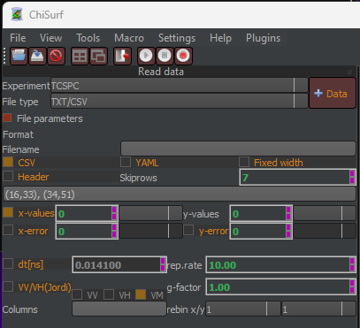

Two single files
^^^^^^^^^^^^^^^^

If the parallel and perpendicular data is saved in two separate files, including a time axis, the following reading parameter should be set:

Note that if the files would contain a header, the checkbox next to :emphasis:`Header` must be selected and the number of rows to skip must be indicated in the :emphasis:`Skiprows` box.

Both :emphasis:`g-factor` and repetition rate (:emphasis:`rep.rate`) can already be fixed here. Giving the correct repetition rate is required in single-molecule experiments where the high repetition rates do not allow a full intensity decay of the fluorophores, and the repeated excitation must be considered in the fluorescence lifetime analysis.
