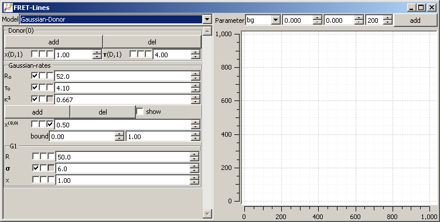
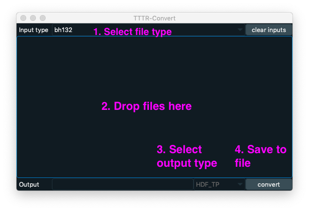
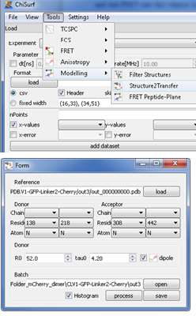
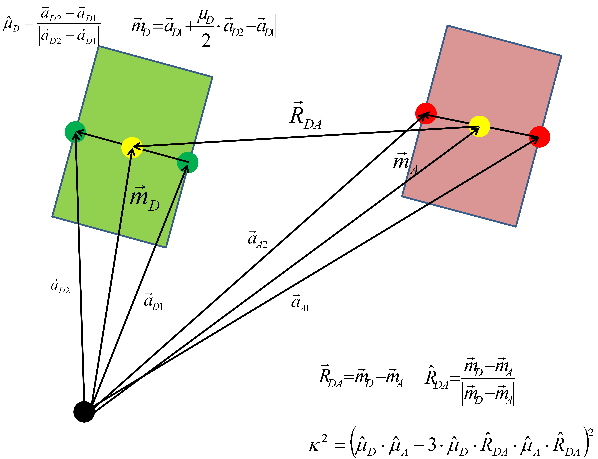

*****
Tools
*****

Quenching estimation
====================

.. image:: ./figures/quest/dye_diffusion.png

FRET-lines
==========

Transfer-calculator
===================

.. image:: ./figures/lifetime_calculators/lifetime_calculator.png

TTTR Converter
==============

There are multiple different TTTR (time-tagged time resolved)
data file formats that reflect the diversity of TTTR instrumentation

1. PicoQuant PTU (multiple instruments)
2. PicoQuant HT3
3. Becker&Hickl Spc132
4. Becker&Hickl Spc630-256, Spc-4096

The TTTR converter can be used to convert the different TTTR formats.
To convert a set of experimental TTTR files, first select the reading
routine that should be used to read the data. Next, drop a set of files
to the empty area in the converter window.

Finally, select the ouput file format and click on convert to save
the files to a single output file.

TTTR Histogram calculation
==========================

Kappa2-Distributions
====================

LabelStructure
==============

The tool LabelStructure can be used to prepare valid JSON files that can be
used in FRET screening and FRET restrained modelling. e.g., using the command
line program `avtraj <https://github.com/Fluorescence-Tools/avtraj>`_ or
`Olga <https://github.com/Fluorescence-Tools/Olga>`_.

To generate a JSON file first, open a PDB file in LabelStructure by clicking on
the three dots next to the "PDB" label (see figure below, number 1). In the
tab "Parameter" the JSON file can be prepared. In the tab "JSON" the generated
JSON file can be inspected and edited. Using the buttons "load", "clear", and
"save" an existing JSON file can be opened, the all current values of the
program can be cleared, and a generated JSON file can be saved, respectively.

.. image:: ./figures/LabelStructure/overview_1.png

Next, define a set of labeling positions. For that, first specify a
name of the labeling position (the name is an arbitrary string), the chain ID
of to which the label is attached to, the residue number of the chain, and the
atom name the which the label is attached to. After specifying the labeling
position, specify the type of the label. First, specify the type of the
simulation that is used to simulate the positional distribution of the label.
Here, there are two options. When the option "AV1" is selected the positional
distribution of the label is simulated by modeling the sterically allowed
conformational space of a sphere that is attached by a flexible linker to the
attachment point. When the option "AV3" is selected three radii describing the
shape of the label are simulated. Second, define the sizes of the label and the
linker attaching the label to the structure by adjusting the parameters
Linker-length, Linker-width, Radius 1, Radius 2, and Radius 3. The parameters
Radius 2 and Radius 3 can only be adjusted when the simulation option AV3 is
used. Finally, click on the button "add labeling position" to add a labeling
position. The added labeling position is displayed in a list.

To define a distance between a pair of labeling positions, first select the
type of the distance. Currently, there are four options where (1) dRDA is
the mean distance between the two labels, (2) dRDAE is mean FRET efficiency
represented by a distance, (3) dRMP is the distance between the mean label
positions, (4) pRDA is the inter-label distance distribution. Warning: not all
options are supported by all software packages using the generated JSON file
as an input. After specifying the distance type, select two labeling
positions from the dropdown menus "Label 1" and "Label 2". Next, enter the
experimentally determined distance with corresponding errors and specify
(if needed) the Forster radius of the labeling pair. Finally, click on
"add distance" to add a distance of the distance list.

The JSON file is displayed in the tab "JSON". The text editor displayed in
the JSON tab can be used to edit the JSON file.

.. image:: ./figures/LabelStructure/overview_2.png

When finished editing the file click on "update". After clicking on "update"
the JSON displayed in the text editor is parsed and displayed in the
"Parameter" tab.

Filter-Structures
======================

Structure2Transfer
======================

Structure2Transfer is a small tool that calculates for a given
set of PDB-files the distance and the orientation factor kappa2.
No fluorophore simulation is performed. Therefore the flurophores
have to be part to the analyzed structures. You can access the
tool Structure2Transfer as depicted below.

After opening the tool the following window becomes visible.
Now first open a PDB-file representative
for the whole set. The program does not do any checking if
atom numbers within the whole set differ.
Therefore make sure all PDB-files are identical except for
their coordinates. After opening the “Reference-structure”
you will be able to define you Donor and Acceptor
fluorophore. The atoms chosen in the “Donor” and “Acceptor”
box define the dipole of the donor and the acceptor-fluorophore.
If the dipole checkbox is not checked only the
first atom in the donor and acceptor definition box will
be used to calculate the distances.

If the “Histogram” checkbox is checked histograms of the
orientation factor kappa2, the donor- and acceptor
distance and the FRET-rate will be plotted after the
processing of the PDB-files. After processing of the
PDB-files the obtained distances, orientation factors
and FRET-rate files can be saved using the “save” button.
The distance between the flurophores and the orientation
factor is calculated as depicted above.

To calculate the donor-acceptor distance in every structure,
on each fluorophore, we chose two
Cbeta-atoms on the beta-barrel, so that the connecting
vector of the two atoms is a good approximation of
the transition dipole. The distance between the middle
points of the connecting vectors of the donor and
acceptor is taken as the distance between the chromophores,
:math:`R_{DA}`. Table 2 lists out the
detailed calculation steps. For every simulated structure,
given the D-A distance and the orientation
factor the FRET-rate was calculated according to

.. math::
    `{k_{FRET}} = \left( {{3 \mathord{\left/ {\vphantom {3 2}} \right. \kern-\nulldelimiterspace} 2}} \right) \cdot {\kappa ^2} \cdot \left( {{1 \mathord{\left/{\vphantom {1 {{\tau _0}}}} \right.\kern-\nulldelimiterspace} {{\tau _0}}}} \right) \cdot {\left( {{{{R_0}} \mathord{\left/{\vphantom {{{R_0}} {{R_{DA}}}}} \right.\kern-\nulldelimiterspace} {{R_{DA}}}}} \right)^6}`

in which :math:`\tau_0` is 2.6ns and the Forster radius,
R0, of GFP and mCherry is 52 Ang including :math:`\kappa^2=2/3`.
The steady-state FRET efficiency Ess was determined
using
.. math::
    `{E_{ss}} = {{{k_{FRET}}} \mathord{\left/ {\vphantom {{{k_{FRET}}} {\left( {{k_{FRET}} + {k_0}} \right)}}} \right. \kern-\nulldelimiterspace} {\left( {{k_{FRET}} + {k_0}} \right)}}`.

Trajectory-converter
======================

Potential-calculation
======================
